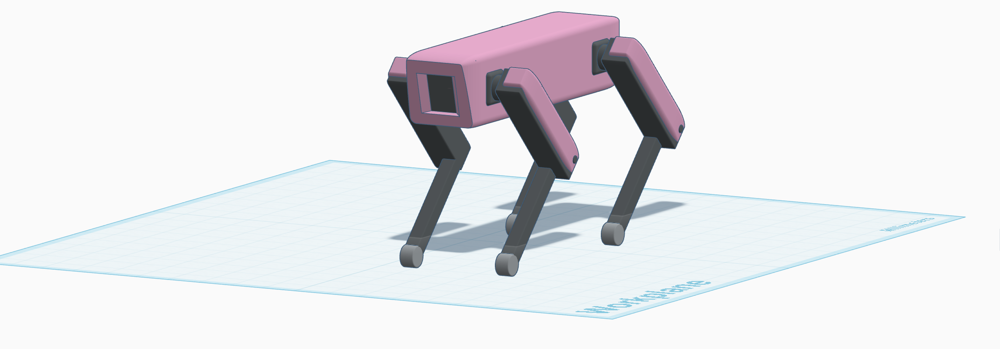

# Robotic Dog Design

## Overview

This project presents an initial mechanical design of a simple quadruped robotic dog.

The design focuses on the basic mechanical concepts required for a robot to stand and move, including the body structure, leg design, joints, degrees of freedom, motor selection, preliminary torque calculation, stability, center of gravity, walking method, and possible mechanical problems.

The robot was designed using Tinkercad as a simple mechanical prototype. The goal is to understand the basic mechanical principles required to build a stable robotic dog.

## Features

- Four-leg quadruped structure.
- Two rotational joints per leg.
- 8 total degrees of freedom (DOF).
- Servo motors proposed for joint movement.
- Preliminary torque calculation for one joint.
- Center of gravity and stability considerations.
- Proposed Trot Gait walking method.
- Simple and lightweight mechanical structure.

## Technologies Used

- Tinkercad
- GitHub

## Project Files

- `README.md`
- `images/robot_front.png`
- `images/robot_side.png`
- `images/robot_top.png`
- `images/robot_detail.png`

## Mechanical Design

The robot consists of a main body and four legs.

The body acts as the main frame and provides support for the robot's components. The four legs are distributed around the body to provide a stable support base.

The following image shows the main mechanical components and important design features.

**Figure 1. Annotated initial mechanical design showing the main body, leg structure, joints, servo motors, center of gravity, and support base.**

## Body and Structure

The main body is designed as a simple rectangular frame that supports the robot's components and connects the four legs.

The structure is kept simple to reduce mechanical complexity while providing enough support for the robot during standing and walking.

The body can be used to hold components such as the battery, microcontroller, and motor control electronics.

## Leg Design

The robot has four legs:

- Front Left Leg
- Front Right Leg
- Rear Left Leg
- Rear Right Leg

Each leg uses a two-link structure with two rotational joints.

The legs provide support for the body and allow the robot to move its feet relative to the body.

## Joints and Degrees of Freedom

Each leg is designed with two rotational joints:

- **Hip Joint:** controls the forward and backward movement of the leg.
- **Knee Joint:** controls the movement of the lower part of the leg.

Therefore:

**4 legs × 2 DOF per leg = 8 DOF**

The proposed robot has a total of **8 degrees of freedom**.

## Motor Selection

Servo motors are proposed for controlling the joints.

Servo motors are suitable for this initial prototype because they allow control of the joint angle and are relatively simple to operate.

The design requires:

- 2 servo motors per leg.
- 4 legs.
- **8 servo motors in total.**

The final motor should be selected according to the required torque, robot weight, leg dimensions, and an appropriate safety factor.

## Preliminary Torque Calculation

A simplified calculation is used to estimate the torque required at one joint.

### Assumptions

- Robot mass = **2 kg**
- Gravitational acceleration = **9.81 m/s²**
- Number of legs = **4**
- Distance from joint to load = **0.10 m**

### Step 1: Calculate the Robot Weight

**F = m × g**

**F = 2 × 9.81**

**F = 19.62 N**

### Step 2: Calculate the Load on One Leg

Assuming the robot's weight is equally distributed between the four legs:

**Force per leg = 19.62 / 4**

**Force per leg = 4.905 N**

### Step 3: Calculate the Torque

The preliminary torque is calculated using:

**T = F × d**

**T = 4.905 × 0.10**

**T ≈ 0.49 N·m**

Therefore, the estimated minimum torque for the selected joint is approximately:

**0.49 N·m**

A motor with a higher torque rating should be selected to provide a suitable safety margin and compensate for friction, acceleration, and uneven load distribution.

> **Note:** This is a preliminary estimate based on assumed robot mass and dimensions. The final torque should be recalculated using the actual robot weight and dimensions.

## Stability and Center of Gravity

The center of gravity should be located close to the center of the robot's body.

Placing heavier components near the center helps improve balance and reduces the possibility of tipping.

The four legs create a support area underneath the robot. For stable standing, the vertical projection of the center of gravity should remain inside this support area.

The wide support base provided by the four legs helps the robot remain stable while standing.

## Proposed Walking Method

The proposed walking method is the **Trot Gait**.

In this method, diagonal pairs of legs move together:

- Front Left + Rear Right
- Front Right + Rear Left

The two diagonal pairs alternate during movement.

This method provides a simple coordination pattern suitable for an initial quadruped robot design.

## Expected Mechanical Problems

Several mechanical problems may occur during development:

- **Insufficient motor torque:** The robot may not be able to support its own weight.
- **Uneven weight distribution:** The center of gravity may move outside the support area and reduce stability.
- **Joint friction:** Friction can increase the required motor torque.
- **Leg bending:** The legs may bend if the material is not strong enough.
- **Mechanical clearance:** Insufficient clearance may cause collisions between moving parts.
- **Loose joints:** Loose connections may cause vibration and unwanted movement.
- **Motor overload:** Motors may become overloaded if the actual robot weight is higher than expected.

## Result

The project demonstrates an initial mechanical design for a simple quadruped robotic dog.

The design includes:

- Four legs.
- Two joints per leg.
- 8 degrees of freedom.
- Proposed servo motors.
- Preliminary torque calculation.
- Center of gravity and stability considerations.
- A proposed Trot Gait walking method.
- Possible mechanical problems and limitations.

The design provides a basic starting point for a future physical prototype. Further improvements can include optimizing the leg dimensions, selecting motors based on actual load measurements, improving the structural strength, and testing the robot's stability and walking motion.

## Author

Wesal Ibrahim Alsharif
CS Student at Taif University
