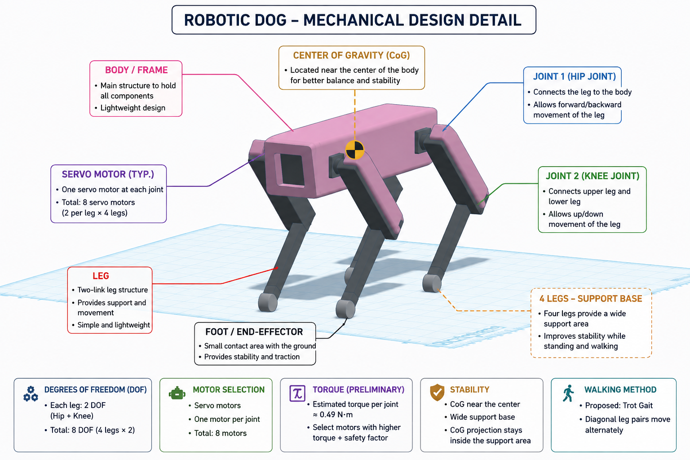

# Robotic Dog Design

## Overview

This project presents an initial mechanical design of a simple quadruped robotic dog created using Tinkercad. The design focuses on the basic mechanical requirements for stable standing and basic walking.

## Mechanical Design

The robot consists of a main body and four legs. Each leg has two rotational joints, providing **8 degrees of freedom (DOF)** in total.

The image below shows the initial robotic dog design with notes highlighting the main mechanical components and important design considerations.

## Motor Selection

Servo motors are proposed for controlling the joints because they provide simple angle control and are suitable for a small robotic prototype.

**8 servo motors = 2 motors × 4 legs**

## Preliminary Torque Calculation

Assumptions:

- Robot mass = **2 kg**
- Gravity = **9.81 m/s²**
- Load distance = **0.10 m**

**Force per leg = (2 × 9.81) / 4 = 4.905 N**

**T = F × d = 4.905 × 0.10 ≈ 0.49 N·m**

Therefore, the selected motor should provide more than **0.49 N·m** with a suitable safety margin.

## Stability and Center of Gravity

The center of gravity should remain close to the center of the body and within the support area formed by the four feet to maintain stability.

## Walking Method

A **Trot Gait** is proposed, where diagonal pairs of legs move together:

- Front Left + Rear Right
- Front Right + Rear Left

## Expected Mechanical Problems

- Insufficient motor torque
- Uneven weight distribution
- Joint friction
- Leg bending
- Mechanical interference
- Motor overload

## Result

The proposed design provides a simple mechanical starting point for a quadruped robotic dog capable of stable standing and basic walking.

## Author

Wesal Ibrahim Alshareef

CS Student at Taif University
